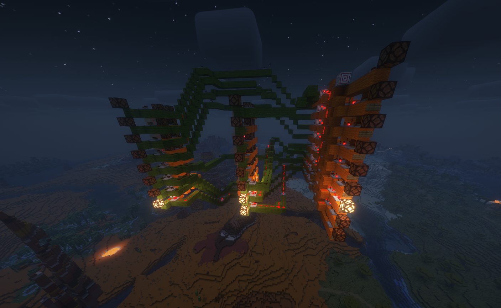

# Red# (In development)

> [!WARNING]
> Red# is currently in active development, it DOES NOT WORK. Well, it does but only for very specific codes. If you want to help please reach out to me on Discord.

Red# (pronounced "Red Sharp") is a programming language that compiles directly inside your Minecraft world using redstone. The language is very simple and will be very slow in-game. This is just a fun development project; it will not create efficient redstone nor help you build a computer in Minecraft. The files use the `.redstone` extension.

Once your code is compiled, a datapack will be created in your world folder. It will add a new command to let you generate the result. First, use `/reload` to reload the datapacks, then use `/function redsharp:generate` to spawn the redstone. Since it is still in development, the file needs to be named `main.redstone` and you need to name your world `RedSharp`, or the program will not find it. This will obviously be customizable later.

<br/>

> [!NOTE]
> Why make this? I got the idea. I wanted to learn Rust. I like Minecraft. I don't know of any other program that does this. So... why not?

Thanks to [Lotus64](https://github.com/lotus64yt) for making the redstone components!


## Development

Currently, the only code that "works" is:
```
let i = 0;
i + 1;
```
That is indeed not a lot, but if I make this work, it will be easy to add other functions since they follow the same logic.

This code generates the following:



You can see three components, from left to right:
- The `i` variable
- The integer `1`
- The adder

I modified the values for the screenshot (`i` equals 1, and the `1` was changed to 3), but as you can see, it successfully computes `1 + 3 = 4`. (The lamps represent the 8-bit binary values of the numbers.)

> [!IMPORTANT]
> The biggest issue right now is the redstone pathfinding. It takes a long time, and some paths fail to generate. That is the main issue at the moment.

## Examples
Variables
```
let i = 0; // Integer variable (8 bits)
let j: u4 = 0; // Integer variable (4 bits)
```

---
Conditions
```
let i = 0;

if 4 > 6 {
    i = 1;
} else {
    i = 2;
}

// There is no else-if for now.
```

---
Loops
```
let i = 0;

// Counter
loop {
    wait(1); // wait 1 seconds
    i += 1;

    if i == 5 {
        break; // Exit the loop
    }
}
```

---
The `debug` function
```
debug("test");

// A special debug function that will print to the chat with a command block
// Useful to debug which code is executed during development
```

---
The `display` and `print` functions
```
let screen = display(8); // Create a 8-bit display
print(screen, 5); // Print 5 on the display

// Alternatively, you can use:
screen.print(5);
```


## Goal
Currently, the program can do almost nothing.
This project will exit its beta phase when the program is capable of compiling all the example codes, as well as this one:
```
let i = 0;
let screen = display(4);

loop {
    i = i + 1;
    print(screen, i);

    if i > 9 {
        break;
    }
}
```

This code can be schematized as follows:  


Since I am the only one working on the code, I will not explain in detail how it works, but this gives you a general idea.

## TODOs:
- Make all the examples work (i.e., finish the project)
- If possible, use multi-threading for pathfinding
- Create a CLI for easier usage
- Make the world path and file name customizable
- Implement the other TODOs written in the code comments